# Kommunicate Android SDK for Chat

An Open Source Android SDK for enabling AI Agent and Live Chat into your Android App

## Overview

Kommunicate provides an open source chat SDK in android. The Kommunicate SDK is flexible, lightweight and easily integrable. It lets you easily add real-time AI agent, live chat, and in-app messaging in your Android app. The SDK is equipped with advanced messaging options such as sending attachments, sharing location and rich messaging.

Kommunicate SDK lets you integrate custom AI agents in your mobile apps for automating tasks. It comes with multiple features to make it a full-fledged customer support SDK.

Kommunicate also includes a built-in human-in-the-loop support system. When an AI agent is unable to understand or resolve a customer query, it can seamlessly escalate the conversation to a live support agent. Human agents can then continue the conversation directly from the Kommunicate platform.

In addition, Kommunicate unifies customer conversations from websites, email, voice, and messaging channels such as WhatsApp, Telegram, Instagram, Viber, and LINE into a single platform, enabling better team collaboration, faster response times, and more efficient issue resolution.

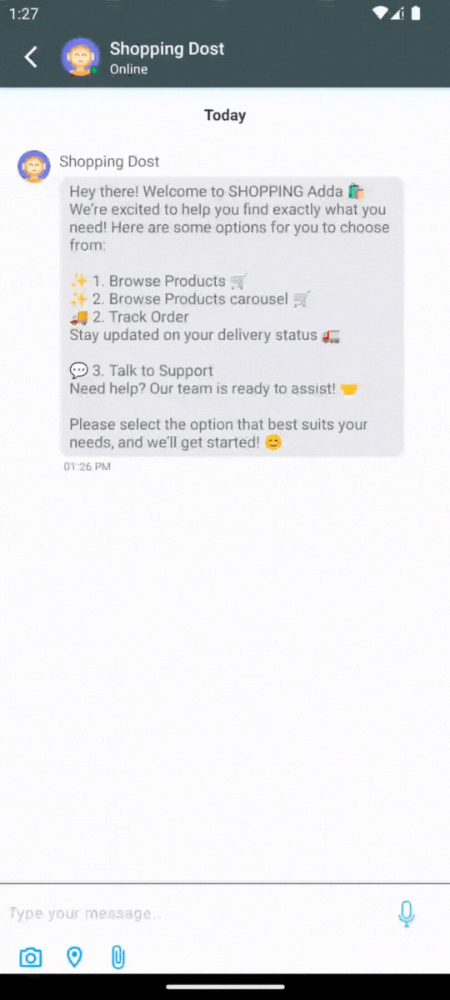

## Get Started

To get started with Kommunicate Android SDK, head over to the Kommunicate website and [Signup](https://dashboard.kommunicate.io/signup?utm_source=github&utm_medium=readme&utm_campaign=android) to get your Application ID.

## Build an AI Agent with Kommunicate and Integrate It into Your Android App

### Kompose AI Agent Builder

Kompose is a no-code AI agent builder that helps businesses build and deploy customer support AI agents across chat, email, and voice channels. Creating an AI agent with Kompose requires no coding skills, simply upload your training materials and provide clear instructions on how the agent should respond and behave.

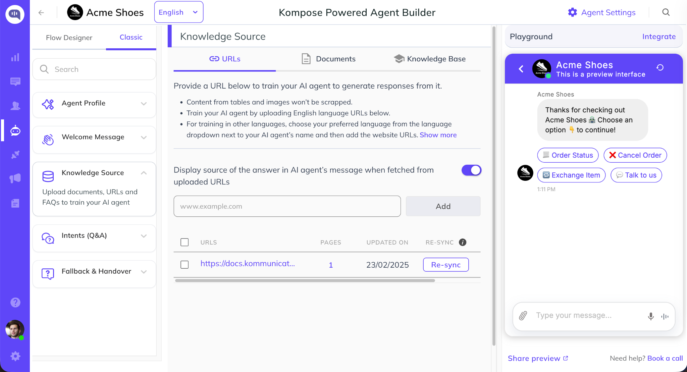

The Kommunicate platform includes a feature-rich chat widget with capabilities such as:

- File and attachment sharing
- Voice AI interactions
- Lead capture forms
- Rich messaging experiences
- Location sharing
- Human agent handoff
- Conversation analytics and reporting

Kommunicate also provides detailed insights into AI agent performance, helping teams identify unanswered queries, optimize responses, and continuously improve automation. When required, conversations can be seamlessly transferred from the AI agent to a human support representative, ensuring customers always receive the assistance they need. All conversations are centrally managed within the Kommunicate platform, allowing support teams to monitor, respond to, and track customer interactions efficiently.

## Prerequisites

- Android 5.0 (API level 21) or higher
- Java 21 or higher
- Kotlin version: 2.0 or higher
- Android Gradle Plugin 8.0 or higher

## Installation

To add the Kommunicate SDK to your Android project, configure the following dependency in your root `build.gradle` file if you are using Gradle 6.7 or earlier.

```gradle
allprojects {
    repositories {
        maven { url 'https://kommunicate.jfrog.io/artifactory/kommunicate-android-sdk' }
    }
}
```

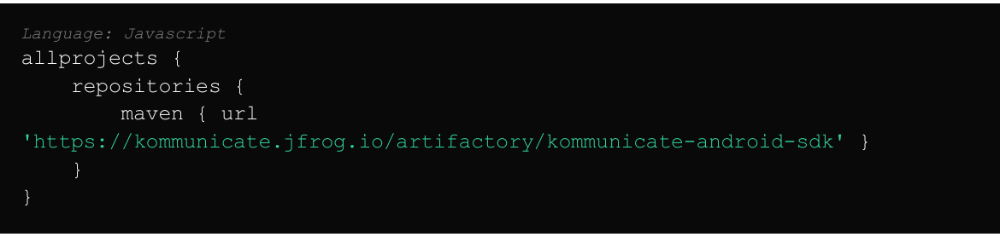

If you are using Gradle 6.8 or higher, add the following to your `settings.gradle` file:

```gradle
dependencyResolutionManagement {
    repositories {
        maven { url 'https://kommunicate.jfrog.io/artifactory/kommunicate-android-sdk' }
    }
}
```

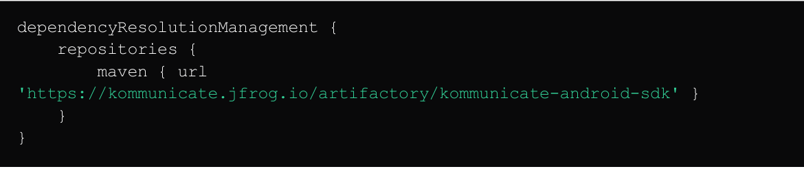

Next, for all Gradle versions, add the dependency to your module `build.gradle` file:

```gradle
dependencies {
    implementation 'io.kommunicate.sdk:kommunicateui:2.16.0'
}
```


Once the build sync is done, you have installed Kommunicate on your app and can proceed to the next step.

## ProGuard Rules

Add these proguard rules in the `proguard-rules.pro` file. If you skip this step then your app might crash in the release build if minify enable is set to true.

```proguard
-keep class net.sqlcipher.** { *; }
-keep class javax.crypto.** { *; }
-keep class net.zetetic.database.sqlcipher.* { *; }
-keep class net.zetetic.database.sqlcipher.** { *; }
-keepattributes *Annotation*
-keep class io.kommunicate.** { *; }
-keep class io.kommunicate.ui.** { *; }
```


## Permissions

Add permissions if you need to use certain features like Camera, Storage, Location then you need to add it to your own app's `AndroidManifest.xml` file.

If you use Camera and Gallery Storage feature, add these permissions:

```xml
<uses-permission
    android:name="android.permission.CAMERA"
    tools:node="merge" />

<uses-permission
    android:name="android.permission.WRITE_EXTERNAL_STORAGE"
    android:maxSdkVersion="32"
    tools:ignore="ScopedStorage"
    tools:node="merge" />

<uses-permission
    android:name="android.permission.READ_EXTERNAL_STORAGE"
    android:maxSdkVersion="32"
    tools:node="merge" />

<!-- Permissions to be used when your app targets API 33 or higher -->
<uses-permission android:name="android.permission.READ_MEDIA_IMAGES" />
<uses-permission android:name="android.permission.READ_MEDIA_VIDEO" />
<uses-permission android:name="android.permission.READ_MEDIA_AUDIO" />
```

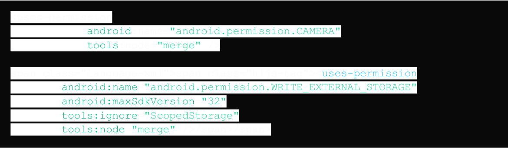

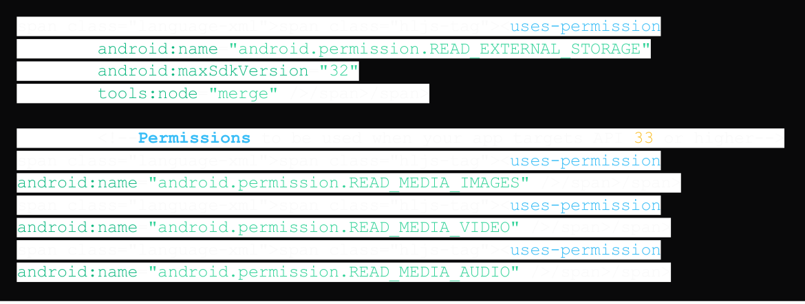

If you use Audio record / Speech to text feature, add these permissions:

```xml
<uses-permission
    android:name="android.permission.RECORD_AUDIO"
    tools:node="merge" />
```


If you use Location feature, add these permissions:

```xml
<uses-permission
    android:name="android.permission.ACCESS_COARSE_LOCATION"
    tools:node="merge" />

<uses-permission
    android:name="android.permission.ACCESS_FINE_LOCATION"
    tools:node="merge" />
```

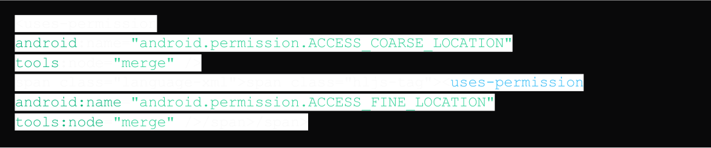

For more information on authentication, push notification, customization, etc, check out our official documentation [here](https://docs.kommunicate.io/docs/android-installation).

## AI Integration Availability

Kommunicate provides integration with the latest AI models from OpenAI, Anthropic, and Google Gemini.

## OpenAI-powered AI Agent Integration for Android App

Kommunicate's OpenAI integration enables businesses to deploy AI-powered customer support agents using OpenAI's latest models. These agents can answer customer queries, automate repetitive support tasks, and seamlessly transfer conversations to human agents when required.

### Integrations Options

You can connect OpenAI to Kommunicate in two ways:

#### Managed Integration via Kommunicate

- No OpenAI account setup required
- Select an OpenAI model directly within Kommunicate
- Simplified billing and configuration

#### Bring Your Own OpenAI API Key

- Connect your existing OpenAI account
- Full control over model selection and API usage
- Use your own OpenAI billing account

### Deployment Steps

#### Step 1: Create an AI Agent

Navigate to Agent Integrations and create a new AI agent using Kompose AI Agent Builder.

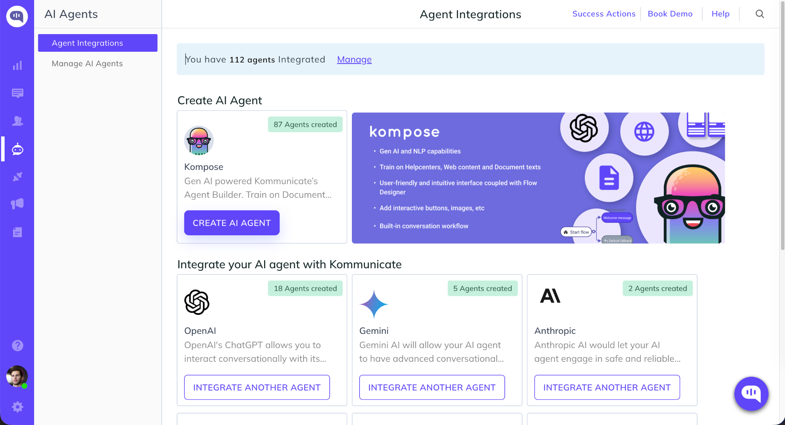

#### Step 2: Configure OpenAI

Choose either:

- Integration via Kommunicate and select an OpenAI model, or
- Integration via API Key and enter your OpenAI API credentials.

Configure model settings such as response length and creativity, then save your configuration.

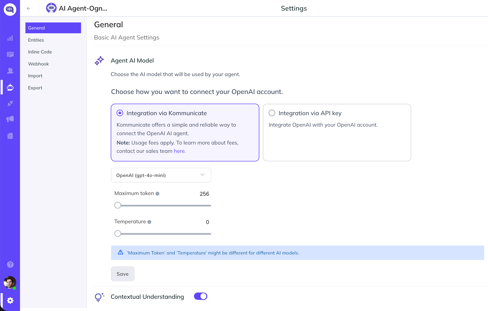

#### Step 3: Train Your AI Agent

Upload documents, connect your help center, or add website URLs to build your AI agent's knowledge base.


## Google CX Agent Studio Integration for Android App

Kommunicate integrates with Google CX Agent Studio, allowing organizations to deploy Dialogflow and CX Agent Studio agents through Kommunicate's omnichannel support platform.

### Why Use This Integration?

- Leverage existing Google CX Agent Studio agents
- Add live chat and human handoff capabilities
- Access centralized conversation management
- Deploy across web and mobile channels

### Steps to Deploy Google CX Agent Studio AI Agent with Kommunicate

#### Step 1: Connect Google CX Agent Studio

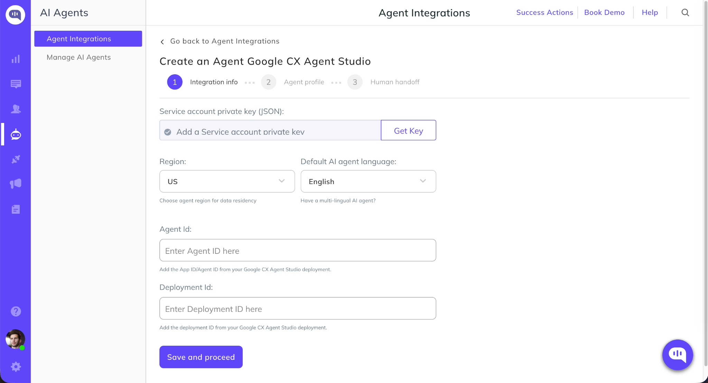

#### Step 2: Add Google Credentials

Enter the required Google Cloud and CX Agent Studio credentials, including project details and authentication information.

Once validated, Kommunicate will establish the connection with your Google agent.

## Google Gemini Integration for Android App

Kommunicate's Google Gemini integration enables businesses and developers to build, deploy, and manage AI-powered customer support agents across websites and digital channels. Use the latest AI models from Google Gemini.

### Ways to Connect Google Gemini with Kommunicate

You can create an Google Gemini-powered AI agent in Kommunicate using either of the following methods:

#### Integration via Kommunicate

Use Kommunicate's managed Google Gemini integration and select your preferred Gemini model directly from the platform.

#### Integration via Google Gemini API Key

Connect your own Google Gemini account by providing a Gemini API key and configuring the AI agent within Kommunicate.

### Setup Instructions

#### Step 1: Create an AI Agent

After signing up for Kommunicate, navigate to Agent Integrations and create a new AI agent using Kompose AI Agent Builder or select Gemini integration.


#### Step 2: Choose Your Google Gemini Integration Method

Select how you would like to connect Google Gemini to your AI agent:

- Integration via Kommunicate - Choose a Google Gemini model directly from Kommunicate and start building your AI agent.
- Integration via API Key - Connect your Google Gemini account by entering your OpenAI API key and configuring the agent with your preferred model and settings.

Once configured, save the settings and begin training your AI agent with your website content, documents, or help center articles.

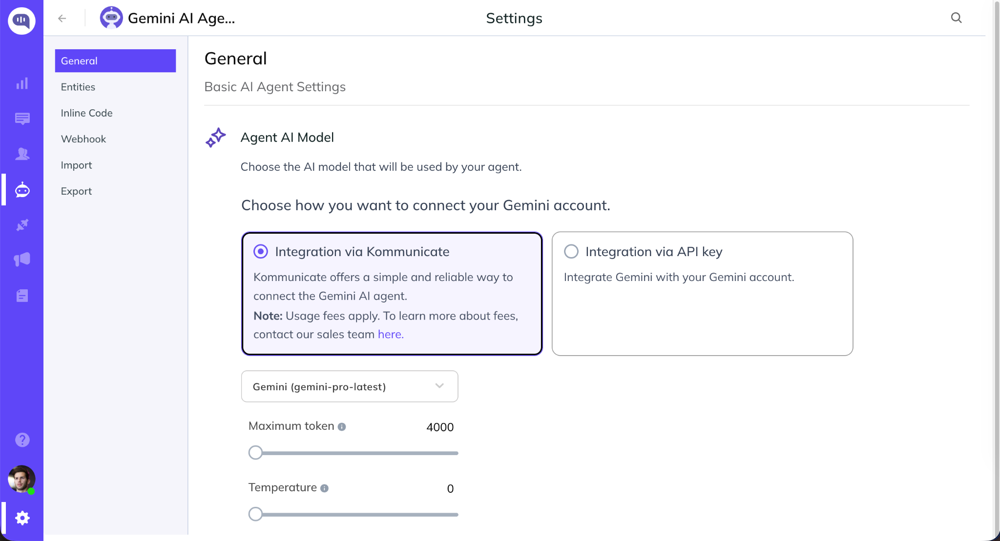

## Anthropic Integration for Android App

Kommunicate's Anthropic integration enables businesses and developers to build, deploy, and manage AI-powered customer support agents across websites and digital channels. Use the latest AI models from Anthropic and resolve customer support queries accurately and instantly.

### Ways to Connect Anthropic with Kommunicate

You can create an Anthropic-powered AI agent in Kommunicate using either of the following methods:

#### Integration via Kommunicate

Use Kommunicate's managed Anthropic integration and select your preferred Anthropic model directly from the platform.

#### Integration via Google Gemini API Key

Connect your own Anthropic account by providing an Anthropic API key and configuring the AI agent within Kommunicate.

### Setup Instructions

#### Step 1: Create an AI Agent

After signing up for Kommunicate, navigate to Agent Integrations and create a new AI agent using Kompose AI Agent Builder or select Anthropic integration.


#### Step 2: Choose Your Anthropic Integration Method

Select how you would like to connect Anthropic to your AI agent:

- Integration via Kommunicate - Choose an Anthropic model directly from Kommunicate and start building your AI agent.
- Integration via API Key - Connect your Antropic account by entering your OpenAI API key and configuring the agent with your preferred model and settings.

Once configured, save the settings and begin training your AI agent with your website content, documents, or help center articles.


